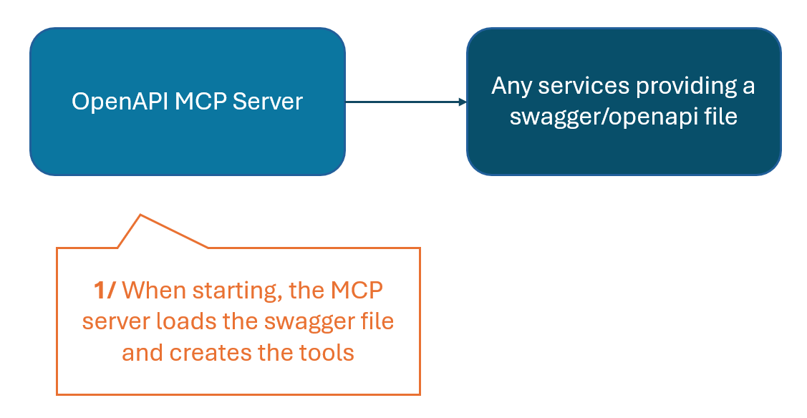
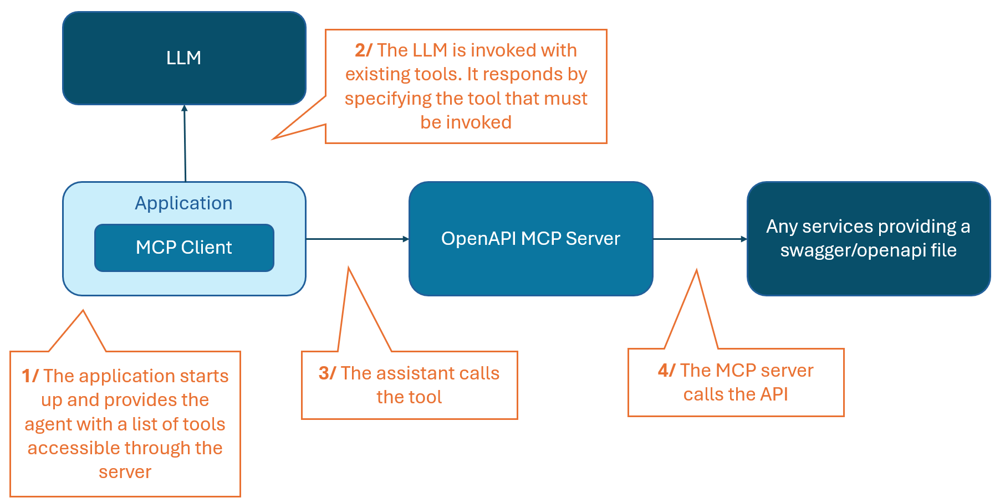
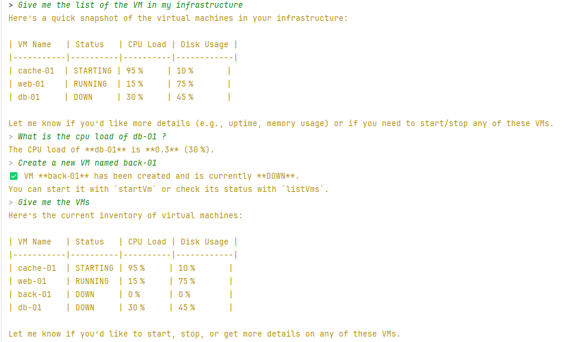

# OpenApi MCP Server

> OpenApiMCPServer is an MCP server that automatically converts any OpenAPI/Swagger specification into a set of usable MCP tools.

It analyzes all API endpoints, generates structured tool definitions, and routes tool calls to the underlying REST API.
This allows AI agents to interact with any OpenAPI-based service instantly, without manual tool coding.

## Modules

There are several modules:
* `openapi-mcp-server`: the application that is a MCP server providing the tools defined in an OpenAPI definition (provided as a local file or an HTTP endpoint)
  * This server dynamically loads the Swagger content and provides the functions of the API through the MCP protocol, so they can be used in a generative AI architecture without recoding anything
  * At startup:

  * At runtime:


* `openapi-mcp-example`: a simple example divided in two parts
  * In `api` package : a fake infrastructure API for managing virtual machines. The API will be invoked by the OpenAPI MCP Server
  * In `assistant` package : an assistant with a simple chat that will use the infrastructure API through the MCP server accessing the API


## Run

### MCP Server

To start the MCP Server
```shell
java -jar $PATH_TO_JAR/openapi-mcp-server.jar --openapi.location=<swagger file or URL>
```

### Example

* Start the example parts, in your IDE, launch:
  * The [InfrastructureApiServer](openapi-mcp-example/src/main/java/io/openapimcp/example/api/InfrastructureApiServer.java) class
  * The [InfraAssistantApp](openapi-mcp-example/src/main/java/io/openapimcp/example/assistant/InfraAssistantApp.java) class by providing the LLM URL and the MCP server

* The MCP server, in the IDE:
  * The [OpenApiMcpServer](openapi-mcp-server/src/main/java/io/openapimcp/server/OpenApiMcpServer.java) class by providing the OpenAPI location and the Spring profile dev if needed

